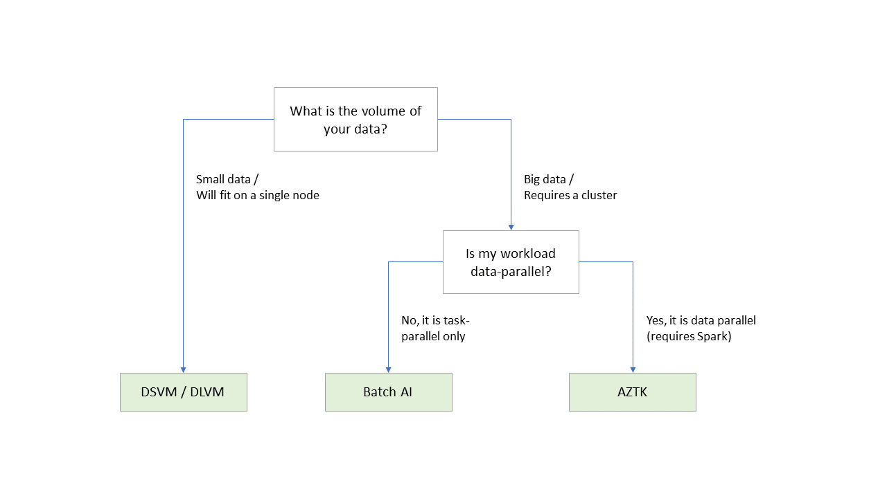
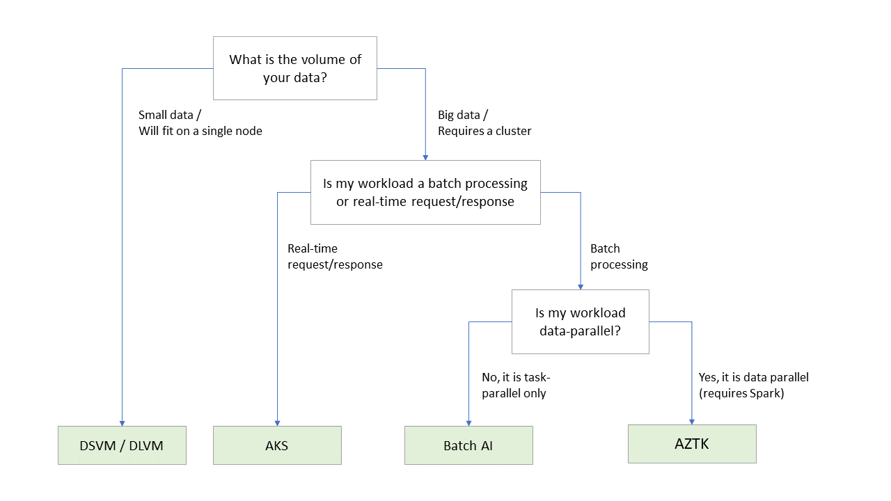

# AI on IaaS++ Toolkit

The AI on IaaS++ toolkit is a set of utility scripts, tutorials, and templates to help data scientists and data engineers work effectively and deploy production code on Azure's AI IaaS++ stack.

## Table of Content
0. [Introduction](#introduction)
    - [What is Azure's AI IaaS++ stack?](#what)
    - [Why use Azure's AI IaaS++ stack?](#why)
1. [Experimentation & Model Development](#experimentation-&-model-development)
2. [Operationalization & Model Deployment](#operationalization-&-model-deployment)
3. [Choosing your Compute Platform](#choosing-your-compute-platform)
    - [Training](#choosing-your-compute-platform-training)
    - [Scoring & Inference](#choosing-your-compute-platform-scoring-&-inference)
    - [Additional Considerations](#choosing-your-compute-platform-additional-considerations)

## Introduction 

### What is Azure's AI IaaS++ stack? 
Today in Azure, there are a myriad of tools and services that were designed for AI workloads. However, for a data scientist new to Azure, there are several entry points where on can start to develop and eventually deploy their AI solutions. 

| Tier         | Name   | Services                                       |
|--------------|--------|------------------------------------------------|
| Highest Tier | AI PaaS   | Databricks, AML                                |
| **Middle Tier**  | **AI IaaS++** | **DSVM/DLVM, AZTK, BatchAI, AKS, Azure Functions** |
| Lowest Tier  | IaaS   | Compute, Network, Storage                      |

This toolkit focuses on the middle tier illustrated in the table above.

### Why use Azure's AI IaaS++ stack? 
Customers can choose to use Azure at each layer of the stack. Each layer has its own mix of benefits and limitations. 

Generally speaking, users may want to use the Azure's AI IaaS++ stack -- as opposed to Azure's AI PaaS stack -- because they want to build their AI solution in a less opinionated, more flexible & customizable, and more cloud-agnostic manner. Additionally, the tools and services in the AI IaaS++ stack tends to be more generally available (in regions) and often adheres to higher compliance and security requirements. 

| | IaaS | AI IaaS++ | AI PaaS | 
| --- | --- | --- | --- |
| Compliance & Security | Mature | Mature | Less Mature |
| Costs | Low | Low | High |
| Flexibility & Customizibility | High | High | Low |
| Availability | Mature | Mature | Less Mature |

*The table above compares IaaS, IaaS++, and PaaS in a general sense. Individual services or tools belonging to each category may not strictly adhere to the table above.

## Experimentation & Model Development 
Below are some general guidelines for how a user may use Azure's AI IaaS++ stack for experimentation and model development.

## Operationalization & Model Deployment 
Below are general guidelines for which compute platforms to use when deploying AI workloads to Azure's AI IaaS++ stack.

## Choosing your Compute Platform 
Azure's AI IaaS++ stack offers many different flexible compute platforms. Often times it is confusing to choose which to use for the scenario at hand. Below are two decision tree to provide guidance on which compute platform to use in different scenarios. 

### Training 

### Scoring & Inference 

### Additional Considerations 
While the above decision trees are useful for most scenarios, each of these services have limitations that may restrict what you choose. Please see the table below:

| | DSVM / DLVM | AZTK | BatchAI | AKS | HDI | 
| --- | --- | --- | --- | --- | --- |
| GPU Support | 1 | 1 | 1 | 1 | 0 |
| Low Priority VMs | 0 | 1 | 1 | 0 | 0 |
| Ability to integrate with Azure Functions | 1 | 1 | 1 | 1 | 0 |
| Machine Learning Server | 0 | 0 | 0 | 0 | 1 |

## Contributing

This project welcomes contributions and suggestions.  Most contributions require you to agree to a
Contributor License Agreement (CLA) declaring that you have the right to, and actually do, grant us
the rights to use your contribution. For details, visit https://cla.microsoft.com.

When you submit a pull request, a CLA-bot will automatically determine whether you need to provide
a CLA and decorate the PR appropriately (e.g., label, comment). Simply follow the instructions
provided by the bot. You will only need to do this once across all repos using our CLA.

This project has adopted the [Microsoft Open Source Code of Conduct](https://opensource.microsoft.com/codeofconduct/).
For more information see the [Code of Conduct FAQ](https://opensource.microsoft.com/codeofconduct/faq/) or
contact [opencode@microsoft.com](mailto:opencode@microsoft.com) with any additional questions or comments.
